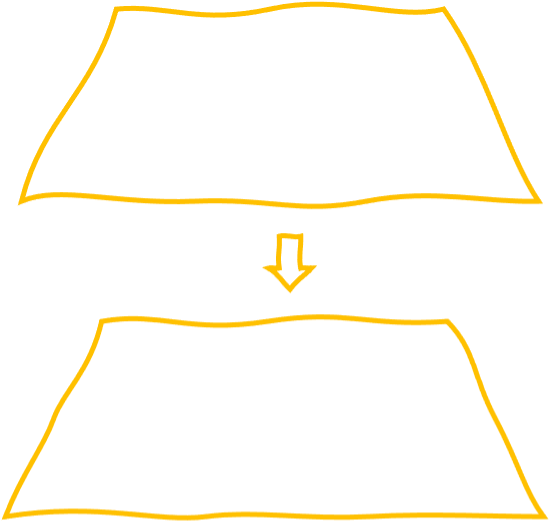

# Universell Informations-utformning

---

## Medel för att uppnå mål

Tänk...

* Lager av arbetsinsatser
* Återanvändbarhet
* System

---

## Uppmärkning

* Märk text
* Här börjar/slutar stycke, här börjar/slutar rubrik, här slutar rad etc

---

## Uppmärkning kan markera

* Positioneringar
* Färger
* Storlekar
* Teckensnitt
* etc

---

## Implikation för designern

* Utforma information OCH 
* sedan presentationslager OCH
* Vara systematisk

---

## Exempel där uppmärkning finns

* Portable Document File
* Microsoft Officedokument
* Webbsidor
* Elektroniska dokument

---

## Uppmärkningsspråk

* PostScript language (PDF)
* Extensible ML - XML (exempelvis Officedokument)
* Hypertext ML - HTML (webbsidor)
* Markdown - MD (enklare version av HTML)

---

## Presentationsspråk

* Stilmallar
* Endast för webbläsare

---

## Måttenheter

### Point

1 Point (pt) = 1/72 inch (~0.3mm)

### Pica

1 Pica (pc) = 12 points

---

## Frågor på detta

* Information på punktskrift

---

(c) Johan Sundström