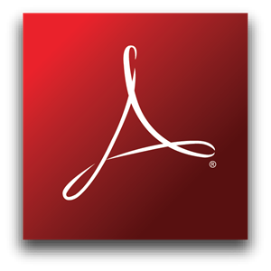
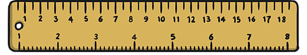

# Postscript - PDF

---


* Skapades 1982 som ett *sidbeskrivningsspråk*
* Språk samt *Interpreter* (översättare)

---


```
%!PS
/Courier findfont 
  20 scalefont 
setfont 
  72 500 moveto 
  (Hello world!) show 
showpage 
```

---



* Adobe Acrobat skapades 1993
* Portable Document Format
* En delmängd av PostScript
* Öppen standard

---


```
%PDF−1.4
...
5 0 obj
  << /Length 73 >>
stream
  BT
    /F1 24 Tf
    100 100 Td
    (Hello World) Tj
  ET
endstream
endobj
...
%EOF
```

---

## Måttenheter



### Point

1 Point (pt) = 1/72 inch (~0.3mm)

### Pica

1 Pica (pc) = 12 points

---

(c) Johan Sundström
