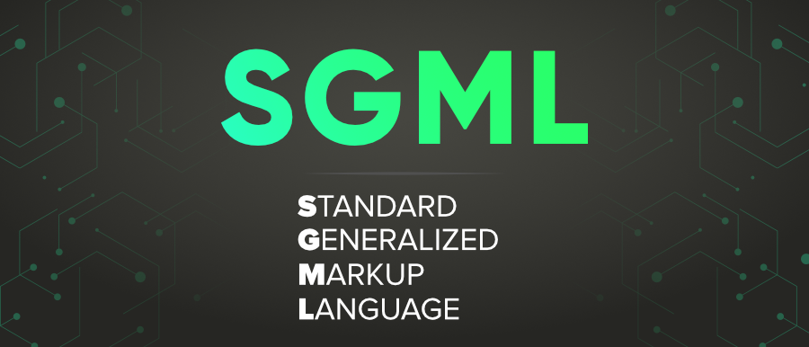
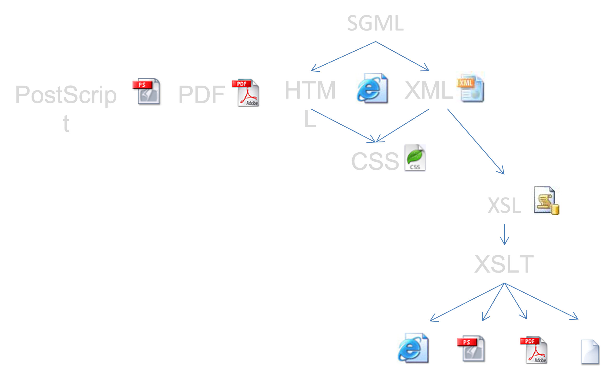

# Allmänt Standardiserat Uppmärkningsspråk

---

## Allmänt

* Standard Generalized Markup Language (SGML)
* Syfte: Allmänn data uppmärkning
* ISO-standard 1986

---

## Unikt för SGML

* Tag´s används för uppmärkning
* Egna namn på uppmärkningar

---

## SGML

<pre><code class="language-html" data-trim></code></pre>

---

## ML-tekniker

---

(c) Johan Sundström