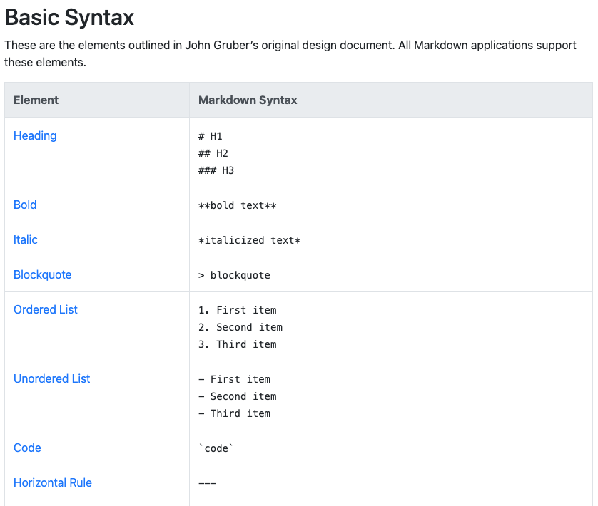

# Markdown

---

## En enklare webbuppmärkning

* Enkelt att läsa
* Enkelt att skriva
* Läsbarhet är prioriterat
* Länkar till mindre antal HTML-element
* Har inte direkt någon presentationsstil

---

## Syntax

---

## Parsed Markdown

* Javascript kan parse'a Markdown
* Javascript kan skapa HTML/CSS i en webbläsare

---

## Exempel

* Demo Markdown i GIT

---

(c) Johan Sundström